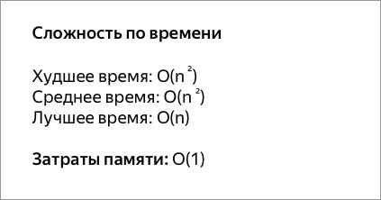

## Java - Алгоритмы и полезные примеры

<details><summary>Алгоритмы на Java ...</summary>

> <details><summary>Пузырьковая сортировка.</summary>
>
> Сортировка пузырьком — один из самых известных алгоритмов сортировки. Здесь нужно последовательно сравнивать значения
> соседних элементов и менять числа местами, если предыдущее оказывается больше последующего. Таким образом элементы с
> большими значениями оказываются в конце списка, а с меньшими остаются в начале.
>
> Этот алгоритм считается учебным и почти не применяется на практике из-за низкой эффективности: он медленно работает на
> тестах, в которых маленькие элементы (их называют «черепахами») стоят в конце массива. Однако на нём основаны многие
> другие методы, например, шейкерная сортировка и сортировка расчёской.
>
> 
>
> 
>
> ```java
> package algorithms;
> 
> import java.util.Arrays;
>
> public class BubbleSortExample {
>
>   public static void main(String[] args) {
>        int[] arrays = genarateIntArrays(10);
>        System.out.println("Пузырьковая сортировка.");
>        System.out.println("Исходный массив: " + Arrays.toString(arrays));
>        System.out.println("Отсортированный: " + Arrays.toString(bubbleSort(arrays)));
>    }
>
>    /**
>     * Метод генерации неупорядоченного массива с указанием размерности в аргументе
>     */
>    private static int[] genarateIntArrays(int len) {
>
>        int[] arrRandom = new int[len];
>        for (int i = 0; i < arrRandom.length; i++) {
>            arrRandom[i] = (int) (i + Math.random() * 10);
>        }
>        return arrRandom;
>    }
>
>    /**
>     * Метод сортировки Пузырьком с аргументом типа целочисленный массив
>     */
>    private static int[] bubbleSort(int[] intArrays) {
>        int k;
>        for (int i = 0; i < intArrays.length; i++) {
>            for (int j = i + 1; j < intArrays.length; j++) {
>                if (intArrays[i] > intArrays[j]) {
>                    k = intArrays[j];
>                    intArrays[j] = intArrays[i];
>                    intArrays[i] = k;
>                }
>            }
>        }
>        return intArrays;
>    }
> }
>
> /* --------------------------------------------------
> Пузырьковая сортировка.
> Исходный массив: [1, 7, 6, 12, 7, 7, 6, 8, 15, 17]
> Отсортированный: [1, 6, 6, 7, 7, 7, 8, 12, 15, 17]
>
> */
> 
> ```
>
> [BubbleSortExample.java](./src/algorithms/BubbleSortExample.java "https://github.com/aykononov/JavaExamples/tree/main/src/algorithms/BubbleSortExample.java")
>
> </details>
>
> <details><summary>Сортировка перемешиванием (Шейкерная сортировка).</summary>
>
> Шейкерная сортировка отличается от пузырьковой тем, что она двунаправленная: алгоритм перемещается сначала слева
> направо, затем справа налево.
>
> 
>
> 
>
> ```java
> package algorithms;
>
> import java.util.Arrays;
>
> public class ShakerSortExample {
>
>    public static void main(String[] args) {
>        int[] arrays = newArrsRandom(10);
>        System.out.println("Шейкерная сортировка.");
>        System.out.println("Исходный массив: " + Arrays.toString(arrays));
>        System.out.println("Отсортированный: " + Arrays.toString(shakerSort(arrays)));
>    }
>
>    /**
>     * Метод генерации неупорядоченного массива с указанием размерности в аргументе
>     */
>    private static int[] newArrsRandom(int len) {
>        int[] arrRandom = new int[len];
>        for (int i = 0; i < arrRandom.length; i++) {
>            arrRandom[i] = (int) (i + Math.random() * 10);
>        }
>        return arrRandom;
>    }
>
>    /**
>     * Метод Шейкерной сортировки с аргументом типа целочисленный массив
>     */
>    private static int[] shakerSort(int[] A) {
>        boolean swapped;
>        do {
>            swapped = false;
>            for (int i = 0; i <= A.length - 2; i++) {
>                if (A[i] > A[i + 1]) {
>                    //проверяем, находятся ли два элемента в нерпавильном порядке
>                    int temp = A[i];
>                    A[i] = A[i + 1];
>                    A[i + 1] = temp;
>                    swapped = true;
>                }
>            }
>            if (!swapped) {
>                //здесь мы можем выйти из внешнего цикла, если обменов не произошло
>                break;
>            }
>            swapped = false;
>            for (int i = A.length - 2; i >= 0; i--) {
>                if (A[i] > A[i + 1]) {
>                    int temp = A[i];
>                    A[i] = A[i + 1];
>                    A[i + 1] = temp;
>                    swapped = true;
>                }
>            }
>            //если никакие элементы не были заменены, то список отсортирован
>        } while (swapped);
>
>        return A;
>    }
> }
>
> /* --------------------------------------------------
>
> Шейкерная сортировка.
> Исходный массив: [6, 10, 2, 9, 6, 6, 10, 9, 17, 18]
> Отсортированный: [2, 6, 6, 6, 9, 9, 10, 10, 17, 18]
>
> */
> ```
>
> [ShakerSortExample.java](./src/algorithms/ShakerSortExample.java "https://github.com/aykononov/JavaExamples/tree/main/src/algorithms/ShakerSortExample.java")
>
> </details>

</details>

<details><summary>Получить список файлов в директории ...</summary>

```java
import java.io.File;
import java.util.Set;
import java.util.stream.Collectors;
import java.util.stream.Stream;

// Пример выводит все файлы в указанной директории + фильтр.
// Фильтрация коллекций с использованием нескольких критериев.

class ListFiles {

    public Set<String> listFilesUsingJavaIO(String dir) {
        return Stream.of(new File(dir).listFiles())
                //.filter(file -> !file.isDirectory())
                .filter(file -> !file.isDirectory() &&  // фильтр: файл не является директорий
                        file.getName().startsWith("GetListFiles")) // фильтр: имя файла начинается с "..."
                .map(File::getName)
                .collect(Collectors.toSet());
    }
}

public class GetListFiles {

    public static void main(String[] args) {
        String dir = "src/main/java/package01/";
        ListFiles listFiles = new ListFiles();
        System.out.println("Получить список файлов в директории: " + dir + "\n..");
        for (String checkFile : listFiles.listFilesUsingJavaIO(dir)) {
            System.out.println(checkFile);
        }
    }
}

/* -------------------------------------------
Получить список файлов в директории: src/main/java/package01/
..
GetListFiles.java
 */
```

[GetListFiles.java](https://github.com/aykononov/JavaExamples/tree/main/src/main/java/package01/GetListFiles.java "https://github.com/aykononov/JavaExamples/tree/main/src/main/java/package01/ListFilesDemo.java")

</details>

<details><summary>Читаем и записываем в текстовый файл (Телефонная книга) ...</summary>

```java
/* Простая база данных телефонных номеров, построенная на основе
   чтения и записи текстового файла со списком свойств.  */

import javax.imageio.IIOException;
import java.io.*;
import java.util.Properties;

public class PhoneBookFromTextFile {
    public static void main(String[] args) throws IOException {
        Properties ht = new Properties();
        BufferedReader br = new BufferedReader(new InputStreamReader(System.in));
        String name, number;
        FileInputStream fin = null;
        boolean changed = false;

        // Попытаться открыть файл phonebook.dat
        try {
            fin = new FileInputStream("src/main/java/package02/phonebook.dat");
        } catch (FileNotFoundException e) {
            // игнорировать отсутствующий файл
        }

        // Если телефонная книга уже существует, загрузить существующие телефонные номера.
        try {
            if (fin != null) {
                ht.load(fin);
                fin.close();
            }
        } catch (IIOException e) {
            System.out.println("Oшибкa чтения файла.");
        } catch (IOException e) {
            e.printStackTrace();
        }

        // разрешить пользователю вводить новые имена и номера телефонов абонентов
        do {
            System.out.println("Добавить контакт ('exit' для завершения).\n ввeдитe имя: ");
            name = br.readLine();
            if (name.equals("exit")) continue;
            System.out.println("Bвeдитe номер: ");
            number = br.readLine();
            ht.put(name, number);
            changed = true;
        } while (!name.equals("exit"));

        // сохранить телефонную книгу, если она изменилась
        if (changed) {
            FileOutputStream fout = new FileOutputStream("src/main/java/package02/phonebook.dat");
            ht.store(fout, "Телефонная книга");
            fout.close();
        }

        //искать номер по имени абонента
        do {
            System.out.println("Поиск контакта по имени ('exit' для завершения).\n ввeдитe имя: ");
            name = br.readLine();
            if (name.equals("exit")) continue;
            number = (String) ht.get(name);
            System.out.println("Контакт: " + name + ", " + number);
        } while (!name.equals("exit"));
    }
}
/* ----------------------------------------------
Добавить контакт ('exit' для завершения).
 ввeдитe имя:
alex
Bвeдитe номер:
111
Добавить контакт ('exit' для завершения).
 ввeдитe имя:
elen
Bвeдитe номер:
222
Добавить контакт ('exit' для завершения).
 ввeдитe имя:
exit
Поиск контакта по имени ('exit' для завершения).
 ввeдитe имя:
alex
Контакт: alex, 111
Поиск контакта по имени ('exit' для завершения).
 ввeдитe имя:
exit

 */
```

[PhoneBookFromTextFile.java](https://github.com/aykononov/JavaExamples/tree/main/src/main/java/package02/PhoneBookFromTextFile.java "https://github.com/aykononov/JavaExamples/tree/main/src/main/java/package02/PhoneBookFromTextFile.java")

</details>

<details><summary>Пример многопоточного приложения с применением класса Phaser ...</summary>

```java
/* Пример многопоточного приложения с применением класса Phaser.

Класс Phaser синхронизирует потоки - он определяет объект синхронизации,
который ждет, пока не завершится определенная фаза.
Далее Phaser переходит к следующей стадии или фазе и снова ожидает ее завершения.
*/

import java.util.concurrent.Phaser;

class PhaseThread implements Runnable {
    Phaser phaser;
    String name;

    PhaseThread(Phaser phaser, String name) {
        this.phaser = phaser;
        this.name = name;

        // регистрирует текущий поток как участника
        phaser.register();
    }

    public void run() {
        System.out.println(this.name + " выполняет фазу " + phaser.getPhase());
        phaser.arriveAndAwaitAdvance(); // сообщает, что Первая фаза достигнута
        try {
            Thread.sleep(100);
        } catch (InterruptedException e) {
            System.out.println(e.getMessage());
        }

        System.out.println(this.name + " выполняет фазу " + phaser.getPhase());
        phaser.arriveAndAwaitAdvance(); // сообщает, что Вторая фаза достигнута
        try {
            Thread.sleep(100);
        } catch (InterruptedException e) {
            System.out.println(e.getMessage());
        }

        System.out.println(this.name + " выполняет фазу " + phaser.getPhase());
        phaser.arriveAndDeregister(); // сообщает о Завершении фаз и удаляет с регистрации объект
    }
}

class MultithreadingUsingPhaser {
    public static void main(String[] args) {
        Phaser phaser = new Phaser(1); // число 1 - главный поток
        new Thread(new PhaseThread(phaser, "PhaserThread 1")).start();
        new Thread(new PhaseThread(phaser, "PhaserThread 2")).start();
        new Thread(new PhaseThread(phaser, "PhaserThread 3")).start();

        // ожидаем завершения фазы 0
        int phase = phaser.getPhase();
        phaser.arriveAndAwaitAdvance();
        System.out.println("Фаза " + phase + " завершена");

        // ожидаем завершения фазы 1
        phase = phaser.getPhase();
        phaser.arriveAndAwaitAdvance();
        System.out.println("Фаза " + phase + " завершена");

        // ожидаем завершения фазы 2
        phase = phaser.getPhase();
        phaser.arriveAndAwaitAdvance();
        System.out.println("Фаза " + phase + " завершена");

        phaser.arriveAndDeregister();
    }
}

/* ----------------------------
PhaserThread 2 выполняет фазу 0
PhaserThread 3 выполняет фазу 0
PhaserThread 1 выполняет фазу 0
Фаза 0 завершена
PhaserThread 1 выполняет фазу 1
PhaserThread 3 выполняет фазу 1
PhaserThread 2 выполняет фазу 1
Фаза 1 завершена
PhaserThread 2 выполняет фазу 2
PhaserThread 1 выполняет фазу 2
PhaserThread 3 выполняет фазу 2
Фаза 2 завершена
 */
```

[MultithreadingUsingPhaser.java](https://github.com/aykononov/JavaExamples/tree/main/src/main/java/package03/MultithreadingUsingPhaser.java "https://github.com/aykononov/JavaExamples/tree/main/src/main/java/package03/PhaseThreadDemo.java")

</details>

<details><summary>Получить текущую метку времени ...</summary>

```java
/* Получить текущую метку времени */

import java.sql.Timestamp;

public class GetCurrentTimestamp {
    public static void main(String[] args) {
        System.out.println(new Timestamp(System.currentTimeMillis()));
    }
}

/*---------------------
2020-11-25 15:36:10.581
 */
```

[GetCurrentTimestamp.java](https://github.com/aykononov/JavaExamples/tree/main/src/main/java/package04/GetCurrentTimestamp.java "https://github.com/aykononov/JavaExamples/tree/main/src/main/java/package04/GetCurrentTimestamp.java")

</details>

<details><summary>Мониторинг файлов с использованием службы наблюдения ...</summary>

```java
/* Мониторинг файлов с использованием службы наблюдения.
 *  WatchService - Служба наблюдения, которая отслеживает зарегистрированные объекты на предмет изменений и событий. */

import java.io.IOException;
import java.nio.file.*;

public class WatcherServiceExample {
    public static void main(String[] args) {

        try (WatchService watchService = FileSystems.getDefault().newWatchService()) {
            Path path = Paths.get("src/main/java/package05");
            path.register(watchService,
                    StandardWatchEventKinds.ENTRY_CREATE,
                    StandardWatchEventKinds.ENTRY_DELETE,
                    StandardWatchEventKinds.ENTRY_MODIFY);
            WatchKey key;
            while ((key = watchService.take()) != null) {
                for (WatchEvent<?> event : key.pollEvents()) {
                    System.out.println(path + ": " + event.kind() + ": " + event.context());
                }
                key.reset();
            }
        } catch (IOException | InterruptedException e) {
            System.out.println(e.getMessage());
        }
    }
}
/* -----------------------------------------
src\main\java\package05: ENTRY_CREATE: a.txt
src\main\java\package05: ENTRY_MODIFY: a.txt
src\main\java\package05: ENTRY_DELETE: a.txt

 */
```

[WatcherServiceExample.java](https://github.com/aykononov/JavaExamples/tree/main/src/main/java/package05/WatcherServiceExample.java "https://github.com/aykononov/JavaExamples/tree/main/src/main/java/package05/WatcherServiceExample.java")

</details>

<details><summary>Перебор строки в цикле ...</summary>

```java
/* Перебор строки в цикле по символам. */
public class StringForEach {
    public static void main(String[] args) {
        String str = "Hello Java";
        System.out.print("Перебор строки в цикле: ");
        for (char c : str.toCharArray()) {
            System.out.print(c + " ");
        }
    }
}
/* ----------------------------------------
Перебор строки в цикле: H e l l o   J a v a 
 */
```

[StringForEach.java](https://github.com/aykononov/JavaExamples/tree/main/src/main/java/package06/StringForEach.java "https://github.com/aykononov/JavaExamples/tree/main/src/main/java/package06/StringForEach.java")

</details>

<details><summary>Переворот строки ...</summary>

```java
/* Переворот строки. */
public class StringReverse {
    public static void main(String[] args) {
        String str = "Hello Java";
        System.out.print("Переворот строки: ");
        for (int i = str.length() - 1; i >= 0; i--) {
            System.out.print(str.charAt(i));
        }
    }
}
/* -------------------------
Переворот строки: avaJ olleH
 */
```

[StringReverse.java](https://github.com/aykononov/JavaExamples/tree/main/src/main/java/package06/StringReverse.java "https://github.com/aykononov/JavaExamples/tree/main/src/main/java/package06/StringReverse.java")

</details>

<details><summary>Найти все числа кратные 9-ти ...</summary>

```java
// Найти все числа кратные 9-ти.
public class ForContionue {
    public static void main(String[] args) {
        for (int i = 0; i < 82; i++) {
            // Оператор деления по модулю % - возвращает остаток от деления.
            if (i % 9 == 0) System.out.print(i + " ");
        }
    }
}
/* ------------------------
0 9 18 27 36 45 54 63 72 81 
 */
```

[ForContionue.java](https://github.com/aykononov/JavaExamples/tree/main/src/main/java/package07/ForContionue.java "https://github.com/aykononov/JavaExamples/tree/main/src/main/java/package07/ForContionue.java")

</details>

<details><summary>Склонение слов в зависимости от количества ...</summary>

```java
// Склонение слов в зависимости от количества.
public class Declination {

    public static void main(String[] args) {
        System.out.println("1 " + getDeclination(1));
        System.out.println("2 " + getDeclination(2));
        System.out.println("5 " + getDeclination(5));
        System.out.println("21 " + getDeclination(21));
        System.out.println("52 " + getDeclination(52));
        System.out.println("105 " + getDeclination(105));
    }

    private static String getDeclination(int count) {
        String one = "день";
        String tow = "дня";
        String five = "дней";

        if (count > 100) count %= 100;
        if (count > 20) count %= 10;
        switch (count) {
            case 1:
                return one;
            case 2:
            case 3:
            case 4:
                return tow;
            default:
                return five;

        }
    }
}
/* ---------
1 день
2 дня
5 дней
21 день
52 дня
105 дней
 */
```

[Declination.java](https://github.com/aykononov/JavaExamples/tree/main/src/main/java/package07/Declination.java "https://github.com/aykononov/JavaExamples/tree/main/src/main/java/package07/Declination.java")

</details>

<details><summary>Генерация случайного числа</summary>

```java
import static java.util.Arrays.stream;
import static java.util.stream.Collectors.toList;

import java.util.List;
import java.util.Random;

/**
 * Генерация случайного числа
 */
public class RandomIntBetweenExclude {
    public static void main(String[] args) {
        System.out.println("Генерация случайного числа, исключая диапазон чисел:");
        System.out.print(nextIntExclude(1, 2, 3, 4, 5) + " ");

        System.out.println("\n");

        System.out.println("Генерация случайного числа в диапазоне min и max, исключая диапазон чисел:");
        System.out.print(nextIntBetweenExclude(7, 10, 9, 10) + " ");
    }

    // Генерация случайного числа, исключая диапазон чисел
    public static Integer nextIntExclude(final Integer... exclude) {
        int result = new Random().nextInt();
        if (exclude.length == 0) {
            return result;
        }
        List<Integer> excludeList = stream(exclude).collect(toList());
        while (excludeList.contains(result)) {
            result++;
        }
        return result;
    }

    // Генерация случайного числа в диапазоне min и max, исключая диапазон чисел
    public static Integer nextIntBetweenExclude(final Integer min, final Integer max, final Integer... exclude) {
        int random = new Random().nextInt(max - min + 1) + min;
        int result = random;
        if (exclude.length == 0) {
            return result;
        }
        List<Integer> excludeList = stream(exclude).collect(toList());
        if (!excludeList.contains(result) && result >= min && result <= max) {
            return result;
        }
        while (result++ != max) {
            if (!excludeList.contains(result)) {
                return result;
            }
        }
        result = random;
        while (result-- != min) {
            if (!excludeList.contains(result)) {
                return result;
            }
        }
        throw new IllegalArgumentException("Все числа из диапазона в списке на исключение!");
    }
}

```

[RandomIntBetweenExclude.java](https://github.com/aykononov/JavaExamples/tree/main/src/main/java/package08/RandomIntBetweenExclude.java "https://github.com/aykononov/JavaExamples/tree/main/src/main/java/package08/RandomIntBetweenExclude.java")

</details>